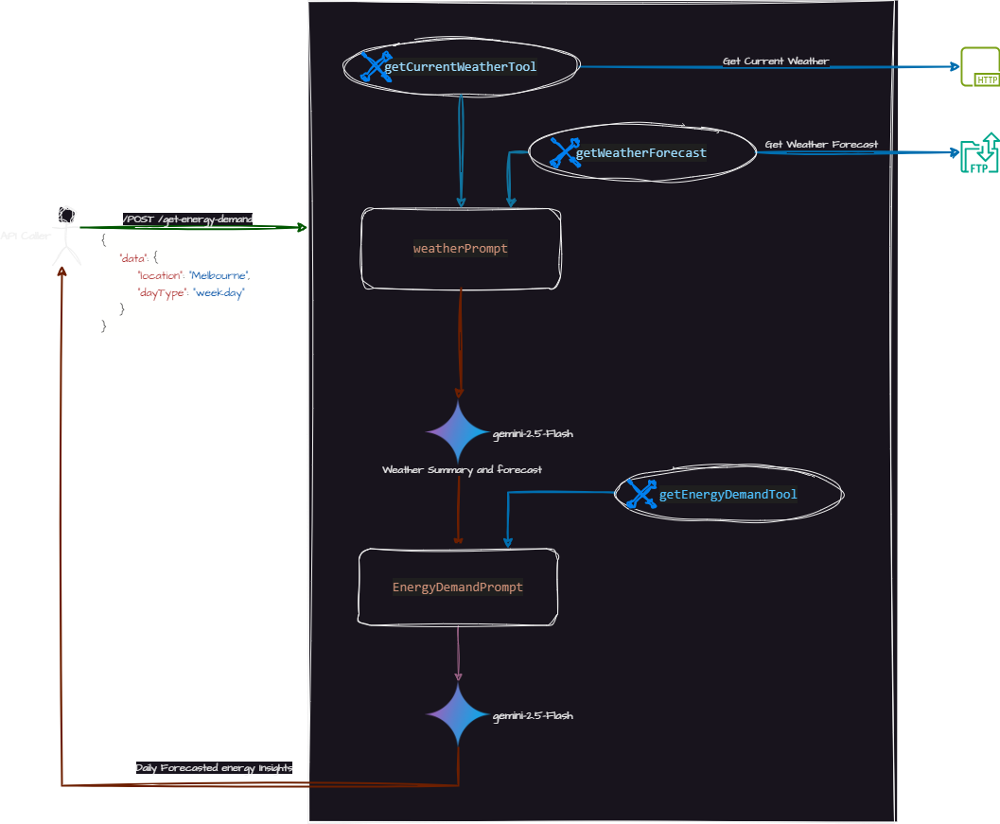

# Genkit Tool Calling

This project demonstates the "tool-calling" capabilities of Google's Genkit framework. It showcases how a generative AI model can use tools to interact with external systems. 

In this case we are using two prompts:

1. weatherPrompt: This prompt uses the "getCurrentWeatherTool" and "getWeatherForecastTool" from "bom-tools.ts" to get the current weather and forecast for next 7 days from an external source (HTTP and FTP).
2. reportPrompt: This prompt uses the "getEnergyDemandTool" from "energy-tools.ts" (Simulated) to predict the demand based on weather.

## Solution Diagram



## Overview

Tool-calling allows you to make your Large Language Models (LLMs) more powerful by giving them the ability to call external functions or APIs. This enables them to fetch real-time information, interact with databases, or perform actions in other systems.

This example project is set up to potentially interact with:

*   **A HTTP Endpoint:** For Current weather in JSON Format.
*   **An Anonymous FTP Location:** For Weather Forecast.
*   **A Simulated output:** For Enenrgy Demand Calculation.

## Prerequisites

Before you begin, ensure you have the following installed:

*   [Node.js](https://nodejs.org/) (LTS version recommended)
*   Follow the steps mentioned in [Genkit | Getting Started]https://genkit.dev/docs/get-started/ 

## Setup

1.  **Clone the repository:**
    ```bash
    git clone <your-repository-url>
    cd genkit-tool-calling
    ```

2.  **Install dependencies:**
    ```bash
    npm install
    ```

4.  **Configure Environment Variables:**

    If not done already, Get your API key from [Google AI studio] https://aistudio.google.com/apikey. You can get an API key for free here. 

    Once you have a key, set the GEMINI_API_KEY environment variable:
    ```bash
    export GEMINI_API_KEY=<your API key>
    ```

## Running the Application


### Genkit UI

To start the application with genkit UI, run:

```bash
npm run build
npm run genkit:ui
```

This will likely start the Genkit developer UI, where you can interact with the defined flows and see how the model calls the configured tools.

### 2. Run as Standalone Application

To start the application without the Genkit UI, run:

```bash
npm run build
npm start
```

